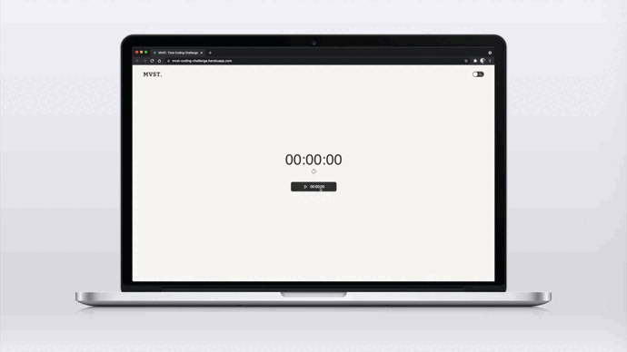

# MVST Time Coding Challenge

- [Introduction & requirements](#introcution-&-requirements)
- [Getting started](#getting-started)
- [Project structure](#project-structure)
- [Deployment](#deployment)
- [Workflow](#workflow)
- [Future improvements](#future-improvements)
- [Feedback](#feedback)
- [Resources](#resources)

## 🧭 Introduction & requirements

This repository contains the coding challenge as a part of MVST. job application process, a **full stack** web application developed using React, NodeJs, ExpressJs and MongoDB.

The purpose of this application is to develop a stop watch that users can start & stop using a central button. Once the button is pressed, the time inside the button starts counting and only when the user presses it back, the total counter is refreshed. All time data is stored in a database to persist data.

The application also has a header with MVST. logotype and a switch that allows the user to change the application theme to light or dark.

> Check the deployed version of this challenge [here](https://mvst-coding-challenge.herokuapp.com/)

## 🚀 Getting Started

The following steps will guide you through the essentials you will have to install and run in order to use this repository and build this application in your local machine.

### Installation🔧

First, you will need to `clone` or `fork` the repository into your Github account. Choose a place in your local machine and paste the next command in your terminal:

```
$ git clone https://github.com/Ricard-Garcia/mvst-coding-challenge.git
```

### Requirements 📋

**Node**

The first step to install and run this application is to make sure you have Node installed on your computer. Go to the terminal, type `node -v` and hit enter. If it returns a version number you already have it installed! Otherwise you will need to [install](https://nodejs.org/es/download/) node.

**Yarn**

Also, since this repository is taking advantage of [Yarn](https://yarnpkg.com/) workspaces (both client and server are inside the same repository), first of all you will need to install `yarn` globally on your computer:

```
npm install -g yarn
```

**MongoDB Atlas**

Since this application is consuming a database stored in MongoDB Atlas, you will need to [create](https://www.mongodb.com/) an account on their website, add a new project and a database. Keep the `username` and the `password` of that database since you will need to provide them in the server .env file.

**Environment variables**

Since

The **client** .env file need to contain the endpoint pointing at the deployed server. This is where the client is getting the data from the database.

```
REACT_APP_API_ROUTE=https://mvst-coding-challenge-api.herokuapp.com/
```

The **server** .env file needs to contain the next variables to connect to [MongoDB Atlas](https://www.mongodb.com/) cluster. Remember the `username` and `password` we kept from the previous step.

```
# Database connection
MONGO_DB_URL_PRODUCTION=mongodb+srv://username:<password>@cluster0.z4nte.mongodb.net/mvst-challenge
MONGO_DB_URL_DEVELOPMENT=mongodb://localhost/4000
MONGO_DB_URL_TEST=mongodb://localhost/4000

# Server settings
PORT=4000

```

### Tests

Both client and server have a couple of tests to check that the main components are rendered (client) and that data format is received correctly from the database (server). To run these tests you can do it like so:

Client tests:

```
yarn client-test
```

Server tests:

```
yarn server-test
```

## 🦴 Project Structure

### Folder structure 🗂

```
├── documentation <i>// All project wireframes, PRD</i>
└── packages <i>// Monorepo workspaces</i>
  └── client <i>// Front end React App</i>
  │ └── src
  │   ├── __test__
  │   ├── api <i>// All api petitions</i>
  │   ├── components
  │   ├── constants
  │   ├── __mocks__ <i>// For testing purposes</i>
  │   ├── pages
  │   ├── sass
  │   └── utils <i>// Reusable code snippets </i>
  └── server <i>// Back end Node Server</i>
    └── src
      ├── __test__
      ├── config
      ├── controllers
      ├── db
      ├── models
      ├── routes
      ├── services
      └── utils
```

### Client 🖥

The client package consists in a React app using a Typescript template. Its `src` folder contains components used in the application and the page that contains all of these components and arranges them in the only view.

In terms of connecting to the API, the client side has an `api` folder that contains all functions needed to create an axios connection to the API endpoint and apply the desired HTTP verb (either `GET` or `PATCH`).

Last but not least, the application is styled with Sass and it is divided into separate files in the application. Some components have their own unique styles while a general styling (a sort of personal Bootstrap) is defined in the `sass` folder where all diferent components are defined for convinence.

### Server 🔐

This server side is where the API is set using NodeJS and connected via Express. The Model/Controller pattern is defined here where `models` set documents in the database and `controllers` modify/create them.

Also, a `db` folder is defined both to make the connection to the database and create a seeder for the original `totalTime` that is displayed in the application (above the button).

## Deployment 🛫

In order to deploy both client and server workspace this application has used [Heroku](www.heroku.com).

## 🗺 Workflow

### Organization 📆

Even though the size of its application is small, the **Scrum Agile Methodology** has been applied to develop it. One can consider this entire tech challenge as a **sprint** consisting of four main **epics** (listed below) all with different **user stories** and subtasks.

**Epics**

- Project configuration
- Frontend structure
- Backend structure
- Documentation
- Remaining tasks

### Naming Strategy

In order to make the application easy to develop (and extend by others!), this previous Scrum methodology has been applied in how branches have been named. See this:

```
epic-name/user-story/1
```

## 🤝 Future improvements

- Authentication.
- Pause but not send time right away.
- Submit time with submit button.
- Explore possibilities in terms of design.
- Choose type of stopwatch.

## Feedback

Simple at first, this application became a bit more complex at the end. The usage of a database to persist the data and consume it in a deployed version (or simply store all time and logs in a database) is something that haven't thought about it in the first step.

Besides that, one main feature I think would be nice to have is an **authentication** so that users can have a log and **display all the different times they entered to total time in a sidebar**, for example. Probably this would extend a bit more this coding challenge but I think it would complete the full stack and entire functionality of an application. It can be either done in [Firebase](https://firebase.google.com/) or usign [JWT](https://jwt.io/).

Also one interesting feature could be **selecting the type of time stopwatch** this application has. It can be a normal **stopwatch**, one with a **set alarm on a timeout**, a lap **stopwatch**,… In terms of design it would not be complex to develop while having to choose which one of this to develop could be an interesting part of the coding challenge.

## 🕵️‍♂️ Resources

### Main resources

- [Axios](https://axios-http.com/docs/intro)
- [Bootstrap](https://getbootstrap.com/)
- [Eslint](https://eslint.org/)
- [Express](https://expressjs.com/)
- [MongoDB](https://www.mongodb.com/)
- [Mongoose](https://mongoosejs.com/)
- [NodeJs](https://nodejs.org/)
- [Prettier](https://prettier.io/)
- [React](https://es.reactjs.org/)
- [SASS](https://sass-lang.com/)
- [Typescript](https://www.typescriptlang.org/)
- [Yarn](https://yarnpkg.com/)

### Libraries

- [Helmet Async](https://github.com/staylor/react-helmet-async)
- [Morgan](https://github.com/expressjs/morgan)
- [Nodemon](https://nodemon.io/)
- [React-icons](https://react-icons.github.io/react-icons/)

## Contributor ✨

👤 [Ricard Garcia](https://github.com/Ricard-Garcia)
